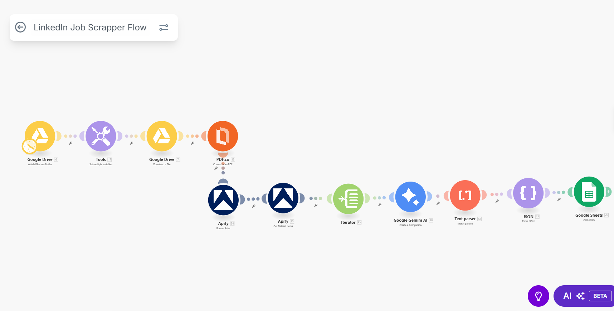
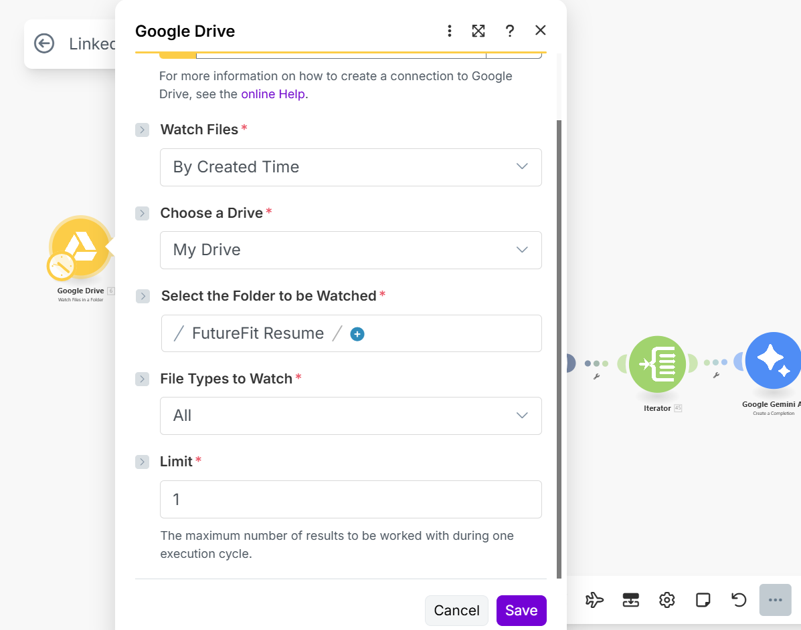
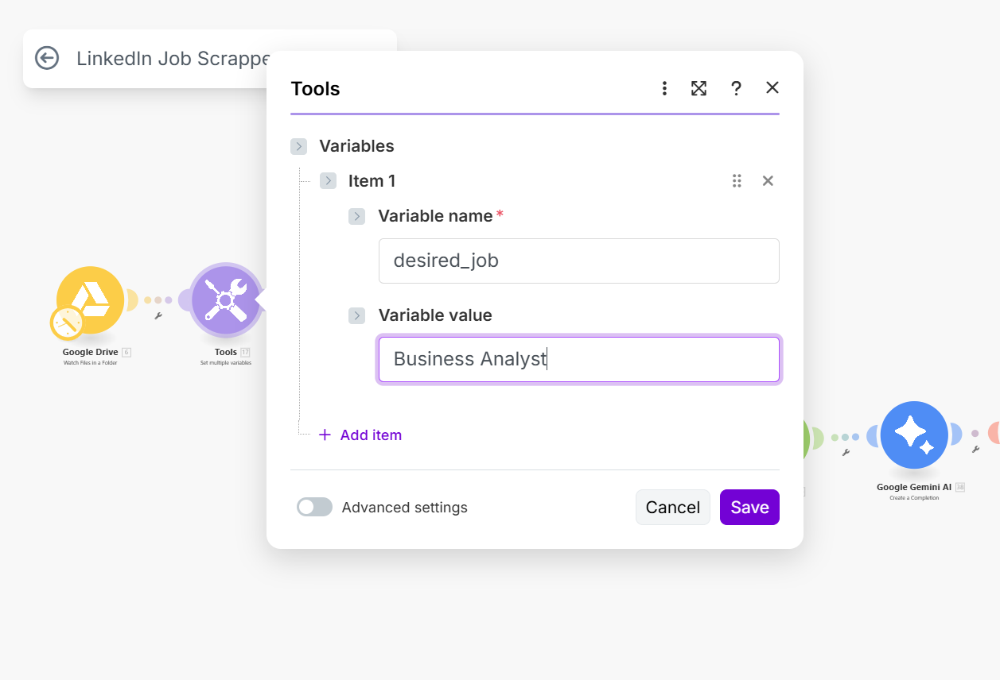
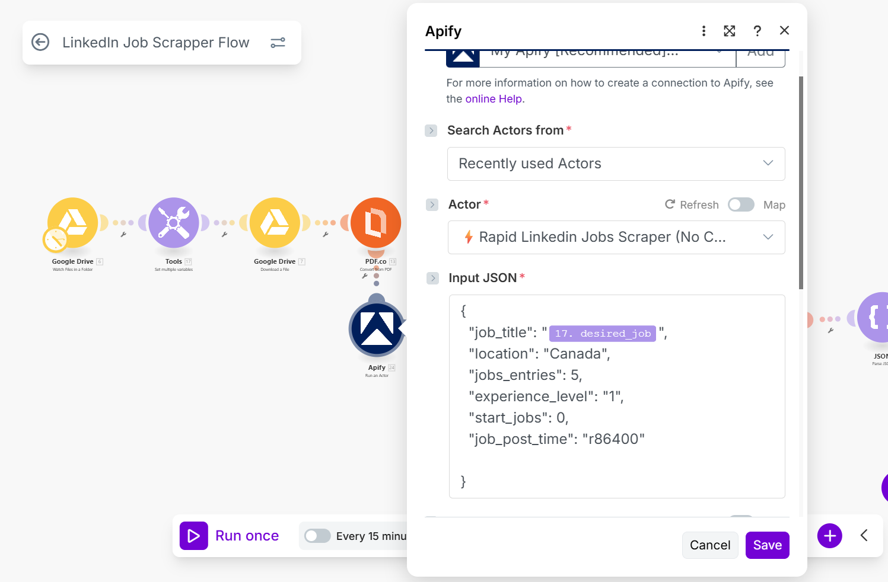
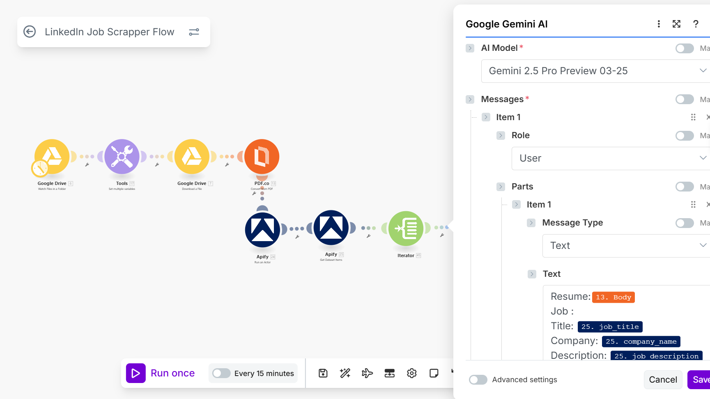
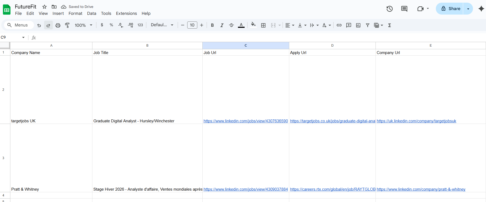

# FutureFit LinkedIn Job Scrapper Flow

This guide explains how to set up the **FutureFit LinkedIn Job Scrapper** automation in Make.com.  
The automation fetches LinkedIn job postings, extracts structured information, and saves them into Google Sheets automatically.

> **At a glance:** Google Drive → Apify → Google Gemini AI → JSON Parse → Google Sheets



---

## What You’ll Build
- Watches for new files in Google Drive
- Uses Apify to scrape LinkedIn job listings
- Transforms job descriptions into structured JSON with Google Gemini AI
- Appends the data into Google Sheets

---

## Step 1: Watch Files in Google Drive
**Module:** Google Drive → *Watch Files in a Folder*  
Watches a specific folder in Google Drive for new uploads and triggers the automation.



## Step 2: Set Variables
**Module:** Tools → *Set Multiple Variables*  
Stores key parameters such as folder IDs, file paths, or temporary values used in later steps.


## Step 3: Download the File
**Module:** Google Drive → *Download a File*  
Downloads the uploaded file (e.g., job links or job descriptions).

## Step 4: Convert PDF 
**Module:** PDF.co → *Convert PDF*  
Converts PDF files into text/JSON for further processing. If jobs are already JSON/CSV, skip this.

## Step 5: Run Apify Actor
**Module:** Apify → *Run an Actor*  
Runs a LinkedIn jobs scraper actor on Apify, using job search parameters or input files.


## Step 6: Get Dataset Items
**Module:** Apify → *Get Dataset Items*  
Fetches the scraped job results from the Apify dataset.

## Step 7: Iterator
**Module:** Iterator  
Iterates over each job result so that the rest of the flow processes them one by one.

## Step 8: Google Gemini AI
**Module:** Google Gemini AI → *Create a Completion*  
Input: Job description text.  
Output: Structured JSON with fields like job_title, company_name, location, employment_type, skills, responsibilities, date_posted, job_url.  

Prompt example:
```text
You are an intelligent system. Extract structured job data from the following job listing text.

Output JSON with these fields:
{
  "job_title": "",
  "company_name": "",
  "location": "",
  "employment_type": "",
  "responsibilities": [],
  "skills": [],
  "date_posted": "",
  "job_url": ""
}
If a field is missing, use "NA".



## Step 9: Text Parser
**Module:** Text Parser → *Match Pattern*  
Extracts key values or ensures formatting is correct for the AI output.

## Step 10: Parse JSON
**Module:** JSON → *Parse JSON*  
Converts the Gemini AI output string into structured JSON.

## Step 11: Google Sheets
**Module:** Google Sheets → *Add a Row*  
Appends the structured job data into a Google Sheet.  
Columns example: Job Title, Company, Location, Date Posted, Employment Type, Skills, Responsibilities, Job URL.




## Key Benefits

- **Time-Saving** → Automates the entire LinkedIn job collection and formatting process.  
- **Consistency** → Ensures every job posting follows the same structured format.  
- **Scalable** → Can process multiple job postings continuously without manual effort.  
- **Customizable** → Easy to tweak prompts, output fields, or sheet structure based on your needs.  
- **Collaboration-Ready** → Data stored in Google Sheets makes it easy to share and analyze with your team.  
